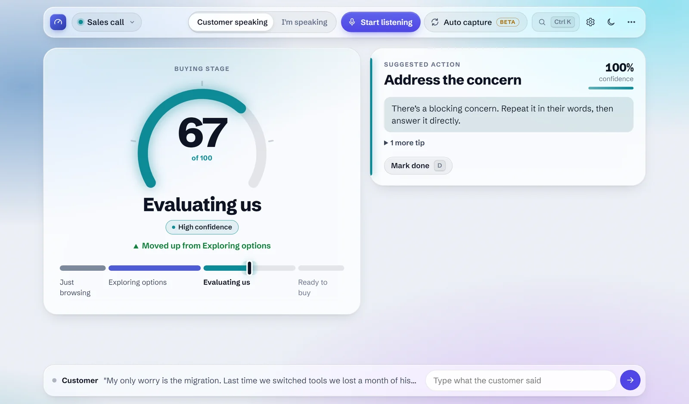
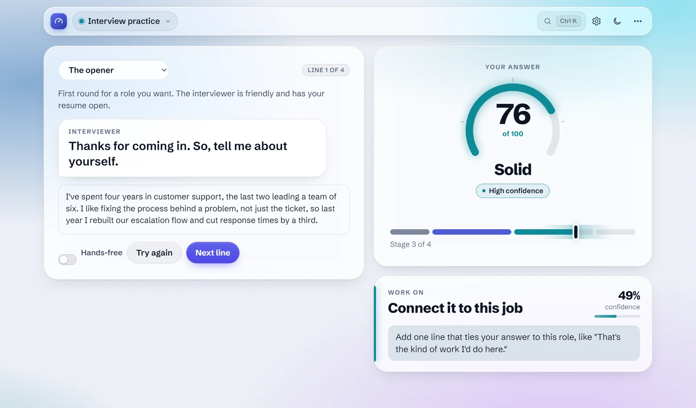
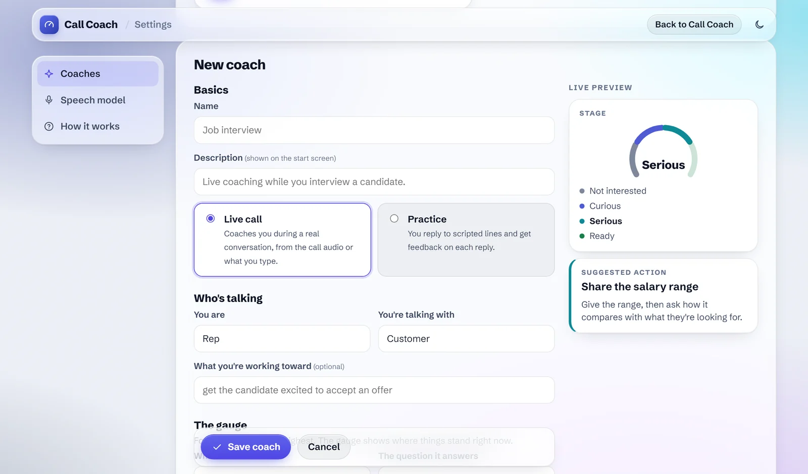
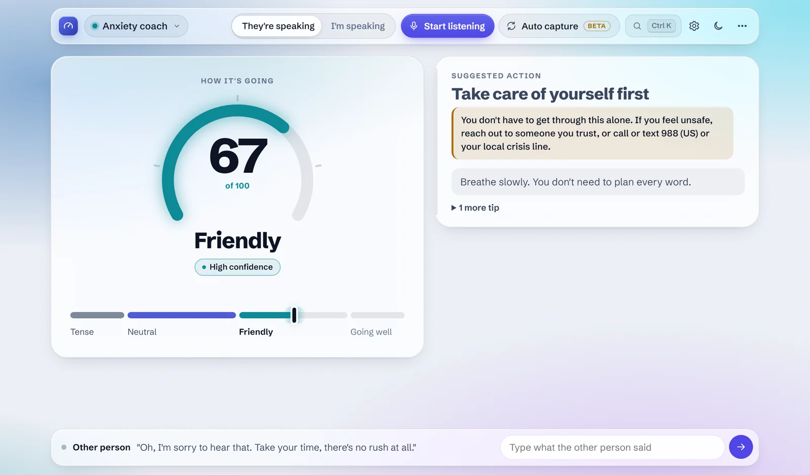
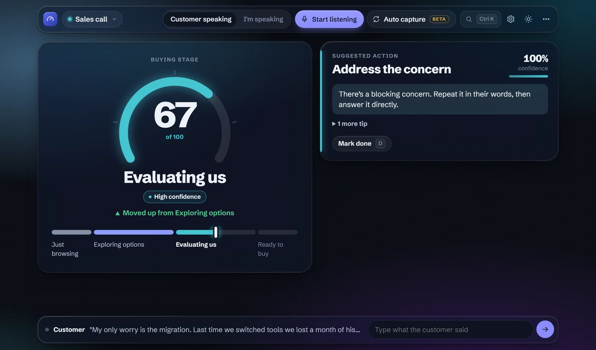
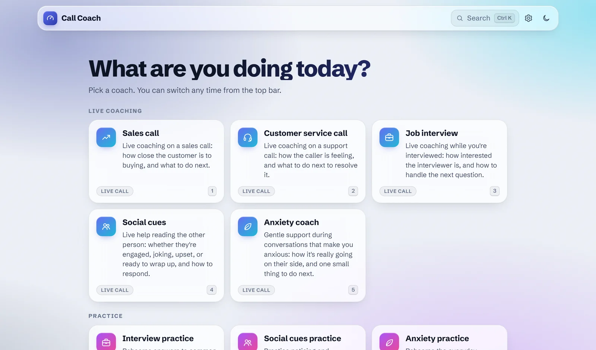
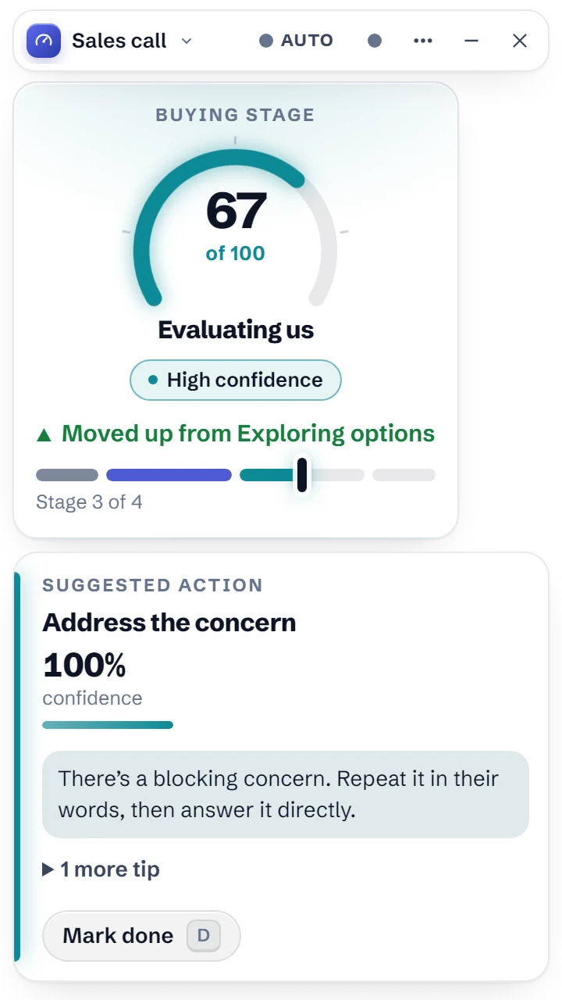
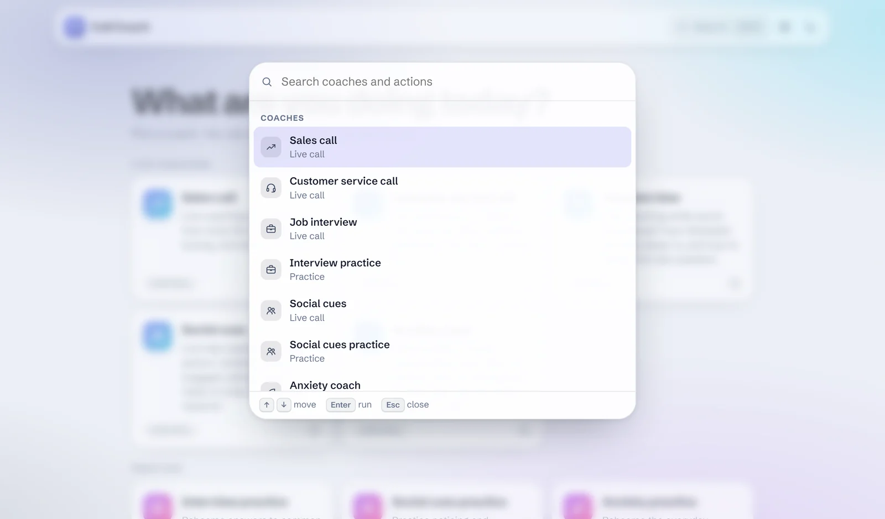

# Call Coach 

A live call coach. It listens to the conversation, sends it to TypeSafe Jev after every sentence, and shows you what to do next with a confidence score. It comes with nine coaches: five for live calls (sales, customer service, job interviews, social cues, and anxiety) and four for practicing on your own, dating included. You can also build your own in Settings.

This is a work in progress and a demo of Jev capabilities. Feel free to fork it and modify it. Or just message me if you want to make any changes. I am also open to pull requests as well for making improvements. Shoot me a DM if you need anything

Free and open source under the [MIT license](LICENSE). See [CHANGELOG.md](CHANGELOG.md) for what's new in 1.1.



## Quick start

1. **Install.** Run `CallCoach-Setup-<version>.exe` (or the portable exe, no install needed).
2. **Connect.** The welcome screen asks for your TypeSafe API key (get one at [typesafe.ai](https://typesafe.ai)) and which speech model to use. Base is the right pick for most computers.
3. **Coach.** A small window floats over your call. Pick a coach, press **Auto** when the call starts, and follow the gauge and the suggested step.

Press **Ctrl K** anywhere to search coaches and actions. **⋯ → How it works** replays the tour.

## Screenshots

<table>
<tr>
<td width="50%"><br><sub><b>Practice by voice.</b> Say your answer; the gauge scores it and names one thing to work on.</sub></td>
<td width="50%"><br><sub><b>Build your own coach</b> in Settings, with a live preview as you type.</sub></td>
</tr>
<tr>
<td width="50%"><br><sub><b>Anxiety coach.</b> If you say you don't feel safe, it puts you first.</sub></td>
<td width="50%"><br><sub><b>Light and dark</b>, on one glass design.</sub></td>
</tr>
</table>


## Get it

You need a TypeSafe API key. There are three ways to run Call Coach:

| | What you get | How |
|---|---|---|
| **Windows installer** | The floating overlay, installed with Start menu and desktop shortcuts | Run `CallCoach-Setup-<version>.exe` |
| **Portable exe** | The same app with no install; runs from anywhere, like a USB stick | Run `CallCoach-<version>-portable.exe` |
| **Website** | The full app in a browser, for you or your team | See [Host it on a website](#host-it-on-a-website) |

The first time the desktop app starts, a short welcome asks for your key and a speech model, and keeps both in your user folder (`%APPDATA%\call-coach`). Speech models download there the first time you use speech.

Because the exe isn't code-signed yet, Windows SmartScreen may say it's from an unknown publisher. Choose **More info**, then **Run anyway**.

### Build the installer

On Windows, with Node.js 18 or newer:

```sh
npm install
npm run dist
```

The installer and portable exe land in `dist/`. `npm run icon` redraws the app icon and the installer's sidebar art in `build/`.

## Run from source

Node.js 18 or newer. Run `npm install` once; it adds the local speech model and the desktop overlay. `Call Coach.bat` (or `npm run overlay`) starts the overlay. To use it in a browser instead:

macOS or Linux:

```sh
TYPESAFE_API_KEY=your_key node server.mjs
```

Windows (PowerShell):

```powershell
$env:TYPESAFE_API_KEY="your_key"; node server.mjs
```

Then open http://localhost:3000, pick a mode, and allow microphone access when the browser asks.

To try a live mode without talking, press **Play sample call**. It feeds a scripted conversation through the real API, one line every few seconds.

## Modes



| Mode | Kind | The gauge shows |
|---|---|---|
| Sales call | Live call | How close the customer is to buying |
| Customer service call | Live call | How the caller is feeling |
| Job interview | Live call | How interested the interviewer is, and how to handle the next question |
| Interview practice | Practice | How strong your answer is, from "Hurts you" to "Standout" |
| Social cues | Live call | How engaged the other person is, and how to respond to their cues |
| Social cues practice | Practice | Whether your reply caught the cue in their last line |
| Anxiety coach | Live call | How the conversation is really going on their side, and one small next step |
| Anxiety practice | Practice | How clearly you came across, from "Stuck" to "Confident" |
| Dating practice | Practice | How well your reply lands |
| Your own | Either | Whatever you set up in Settings |

Use **Change mode** (or click the mode name in the overlay's title bar) to switch.

The social cue coaches explain the cue behind each suggestion ("short replies and "anyway" usually mean they need to go"), so the skill builds over time. The anxiety coaches are deliberately gentle: small steps, encouraging feedback, and a gauge that shows how the other person is actually responding. They're a supportive tool, not a substitute for professional care. If someone says they feel unsafe, the coach sets its suggestions aside and points them to people they trust or a crisis line.

## The overlay



The desktop app floats one small window over your call, with both cards in it. Drag it by its title bar; it remembers where you left it. The title bar holds what you need mid-call:

- The **coach name**: click it to switch coaches.
- **Auto** and **●**: auto capture and call capture.
- **⋯**: clear the conversation, open the dashboard (transcript and signals), change coach, open Settings, or switch light and dark.

Everything in the overlay sits on solid cards, so it stays readable over any window or wallpaper. On Windows 11 you can try real glass behind it instead by starting the app with `CALL_COACH_GLASS=1`; Windows only draws that glass while the window has focus, and shows flat gray otherwise, which is why it's off by default.

## The look

The app, Settings and the website share one design system (`public/theme.css` and `public/ui.js`):

- **Glass for controls, frosted panels for content.** Toolbars, menus and the command palette are translucent; the cards you read are denser, so text keeps strong contrast over anything.
- **Light that follows the conversation.** The glow behind the glass takes the gauge's stage color, so the whole screen shifts as a call moves from browsing to ready.
- **Purposeful motion.** Things ease out as they arrive and ease in as they leave, in 120–360 ms. The gauge and cards settle with a gentle spring; screens cross-fade.
- **Keyboard first.** Ctrl K opens a command palette; number keys pick a coach on the start screen; S and D switch speaker and mark a step done.
- **Respects your settings.** Reduce motion turns animations off, reduce transparency and more contrast make every surface solid, and dark mode is one click away.



## Build your own coach

Open **Settings** (the header in the browser, or **⋯ → Settings and coaches** in the overlay) to create coaches for other conversations: job interviews, negotiations, a support desk, or practice for something you're nervous about. No code needed:

1. Choose **New live coach** or **New practice coach**, or **Duplicate** a built-in coach to start from one that works.
2. Say who's talking and what you're working toward.
3. Set up **the gauge**: what it measures and its four levels, lowest to highest.
4. List the **next steps** the coach can suggest (or, for practice, the things to work on), each with when to suggest it and a tip. Higher in the list wins ties.
5. Optionally add yes/no **signals** for the dashboard and, for practice, **scenarios**: the other person's lines, in order.

Save it, and it's on the start screen. **Export** saves a coach to a file you can share; **Import** loads one. Custom coaches are stored in the app on your computer (on a website, in your browser), and their questions are sent along with each request.

## Using it on a call

1. Press **Start listening**.
2. Switch between **Customer speaking** and **I'm speaking** as the conversation goes back and forth, or press **S** on the keyboard.
3. Watch the gauge. It shows the score (0-100), the current stage, and a confidence label.
4. The card below shows the suggested next step and coaching tips.
5. Press **D** or the **Mark done** button to dismiss a suggestion for a few minutes.

### Auto capture (experimental)

**Auto capture** coaches hands-free. It records the call audio and your microphone as two separate streams, so it knows who said what without the speaker toggle:

- Call audio (Zoom, Meet, Teams, a phone app) is the **customer**.
- Your microphone is **you**.

Both are transcribed on your computer by the local Whisper model; only the text goes to TypeSafe. In the overlay (`Call Coach.bat`), press **Auto** in the title bar. In the browser, press **Auto capture** and share the tab or screen the call is in, with **Share audio** checked.

- **Only use it when everyone on the call knows and agrees.** Recording laws differ by place, and many require consent from every party.
- **Headphones work best.** Through speakers, your mic also hears the customer. Auto capture recognizes those echo segments and drops them, and when you talk over the customer it keeps your words and trims the echo around them. On a real call it's a best effort, not a guarantee.
- **Pick the speech model for your machine** in Settings. On a 16-core desktop CPU, a 6-second line takes about 1 s with Tiny, 2 s with Base, and 5 s with Small; laptops will be slower. If the app says transcription is falling behind, choose a smaller model.
- Only the customer's lines trigger a new evaluation. Your lines are included with the next one, which keeps API calls down.

## Practice mode

Practice modes need no call and no one else. Pick a scenario, and the other person says a line. Type your reply and press **Get feedback**, or talk:

- Press **Speak** and your words appear as you say them.
- **Stop talking and it sends.** A short countdown runs on the button first; keep talking to add more. If you trail off mid-thought ("…and", "because", "um"), it waits longer, so pausing to think won't cut you off.
- **Send now** skips the countdown; **Stop** or **Esc** stops listening and keeps what you said, to edit or send yourself.
- Turn on **Hands-free** and the mic starts by itself on every new line and after **Try again**, so you can practice a whole scenario by voice.

The gauge scores your reply and the card below names one thing to work on. Press **Try again** to redo a reply and see whether the score moves up, or **Next line** to continue the conversation.

In the overlay, picking a practice mode opens it in its own window, since it doesn't need to float over a call.

## Host it on a website

The same server runs as a website. Visitors enter their own TypeSafe key in **Settings**; it stays in their browser and passes through your server to TypeSafe without being stored. Speech is transcribed in each visitor's browser, so their audio never leaves their computer and your server does no heavy lifting. The mic needs HTTPS, which most hosts provide.

With Docker (Render, Railway, Fly.io, a VPS, and so on):

```sh
docker build -t call-coach .
docker run -p 8080:8080 call-coach
```

Without Docker, on any host with Node.js 18 or newer:

```sh
npm ci --omit=dev --omit=optional
HOSTED=1 node server.mjs
```

The hosted server has no npm dependencies at all. Settings for the website, as environment variables:

| Variable | Effect |
|---|---|
| `HOSTED=1` | Website mode (set in the Docker image) |
| `ACCESS_CODE` + `TYPESAFE_API_KEY` | People who enter the access code in Settings use your key; others can still use their own |
| `OPEN_ACCESS=1` + `TYPESAFE_API_KEY` | Anyone can use your key. Only for private networks |
| `RATE_LIMIT_PER_MINUTE` | Coaching requests per visitor per minute (default 30) |
| `TRUST_PROXY=1` | Behind a load balancer, count visitors by `X-Forwarded-For` (set in the Docker image) |
| `TRANSCRIBE` | `browser` (default when hosted), `server` (needs the optional packages), or `off` |

A website can't call TypeSafe directly from the browser (TypeSafe doesn't allow it), so it needs this server; a static host like GitHub Pages won't work on its own.

## Project structure

```
server.mjs          Node server: proxies API calls, serves public/, desktop or hosted
electron.js         Desktop app: the overlay, Settings, practice and dashboard windows
public/
  index.html        The main UI: mode picker, live coaching, practice
  settings.html     Coaches (build, duplicate, import, export), speech model, website key
  theme.css, ui.js  The shared design system: colors, glass, motion, icons, menus, command palette
  setup-key.html    The desktop app's first-run welcome
  fonts/            Schibsted Grotesk, bundled so the app works offline
  dashboard.html    Transcript and signals (from the overlay)
  modes/<mode>/     One folder per built-in mode (see "Adding a mode")
  coaches.js        Custom coaches: storage, and turning the Settings form into a mode
  capture.js        Call audio capture (Capture call, Auto capture, Speak)
  segmenter.worklet.js  Cuts audio into lines at natural pauses; detects mic echo
  transcriber.js    Speech to text, on the server or in the browser (asr-worker.js)
  decide.js         Local decision logic (smoothing, stability, tie-breaking)
tools/
  check-modes.mjs   Checks every mode's files agree with each other
  make-icon.js      Draws the app icon
Dockerfile          The website image
```

## How it works

```
Microphone / call audio -> speech-to-text -> transcript
  -> server.mjs (adds your API key and the mode's questions) -> TypeSafe Jev
  -> next action (Choice) + stage (Score) + signals (Noul) -> decide.js + the mode's playbook -> screen
```

In the desktop app the API key stays in the server and never reaches the page. Every question is asked in a single request, so each update costs one API call.

## Adding a mode

Every mode runs on the same engine. The easiest way to add one is **Build your own coach** in Settings. To ship a mode with the app itself, add a folder in `public/modes/` with three files:

- **`mode.json`**: the name and description shown in the picker, `kind` (`"live"` or `"rehearsal"`), what the two speakers are called in the transcript Jev reads, and which questions drive the screen (`questions.action` must be a choice question and `questions.stage` a score question with four levels).
- **`schema.json`**: the questions sent to Jev.
- **`playbook.js`**: what the screen shows: the four stage names, a title and tips for every action option, priorities and rules, screen text (`copy`), dashboard `signals`, and a `sample` call (live modes) or `scenarios` (practice modes).

Copy an existing mode folder as a starting point, then run `npm run check-modes` to catch mismatches, like an action with no tips or a tip that names a question the schema doesn't ask. Restart the server to pick up the new mode.

## Customizing

- **Questions:** edit `public/modes/<mode>/schema.json`. Restart the server after changes.
- **Actions and coaching tips:** edit `public/modes/<mode>/playbook.js`. Keys must match the options in `schema.json`.
- **Decision tuning:** edit the constants at the top of `public/decide.js` (minimum confidence, smoothing, hysteresis). A playbook can override them for its mode with `config`.
- **Model:** set `TYPESAFE_MODEL`. The default is `jev-latest`. For anything beyond a demo, pin a specific version so behavior doesn't shift under you.
- **Port:** set `PORT` (default 3000).
- **Live transcript model:** the words shown while you talk come from a small, fast model (`ASR_QUICK_MODEL`, default Tiny); the final text uses the model picked in Settings.
- **Speech model threads:** set `ASR_THREADS` (default: half your CPU threads, at most 4). More threads is often slower, because the model's two parts compete for cores.
- **Echo detection:** edit `ECHO` at the top of `public/capture.js`.

## Things to know

- **Where speech goes.** Capture call, Auto capture and Speak transcribe on your computer (on a website, in your browser). **Start listening** uses the browser's built-in speech recognition instead, which in Chrome sends audio to Google. Check that this is acceptable before using it on real customer calls.
- **Conversation text goes to TypeSafe.** Don't use this on calls where card numbers, passwords, or similar details might be spoken.
- **The microphone hears everyone.** On a speakerphone or video call, both sides end up in one transcript, so the speaker toggle matters. Auto capture avoids this by keeping the call audio and your mic separate.
- Only the last 40 turns of the conversation are sent, to keep each request small.
